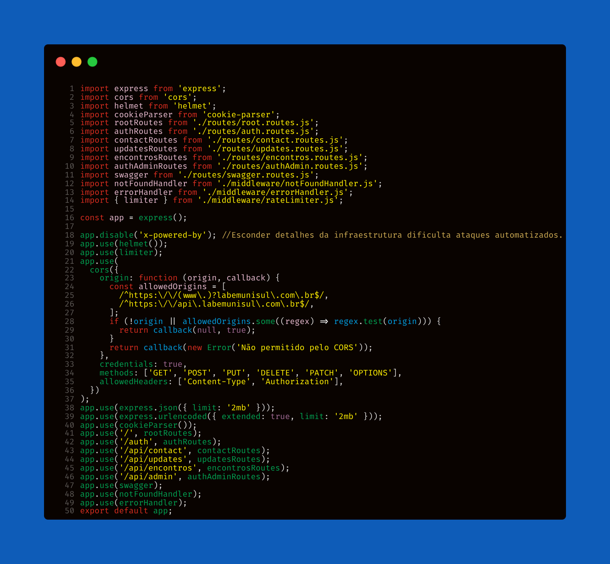

<!-- Title here! --> 
  
 
 <!-- stacks --> 
      <a href="./README.md">  <!-- This badge links to the Portuguese README at the project root --> </a>  
 
    
 <!-- image -->  <h2>Project Goal</h2> 
 This system was built to level up management for the Biomedical Aesthetics Academic League at UNISUL. It provides a centralized digital platform for networking, organizing events, workshops, and collaborating with brands in the field. Until now, the League didn’t have its own solution for sharing exclusive content, managing patient-model calls, or highlighting strategic partners.    The platform offers secure and custom dashboards for professors, coordinators, the president, and members, giving them full control over content, events, and internal comms. It’s designed for both the academic crowd and the broader community, promoting professionalism, transparency, and high standards in league operations. 
 
 <h2>Docs</h2>  
 Check out the full Swagger docs at:  <a href="https://www.labemunisul.com.br/swagger.html">https://www.labemunisul.com.br/swagger.html</a> 
 <h2>Authentication & Security</h2> 
 <code>JWT</code> auth runs on <strong>httpOnly cookies</strong>, keeping session tokens secure from XSS attacks. The backend uses the <code>cookie-parser</code> middleware to read auth cookies on protected routes. The frontend is set up to never handle tokens directly—every authenticated request uses <code>credentials: 'include'</code>.   Sensitive values are managed via <code>dotenv</code>. Passwords are encrypted with <code>bcrypt</code>, and <code>CORS</code> is enabled for safe frontend/backend integration.   <strong>No open registration: this is a FIXED team! Access is generated via a temp script, and passwords are hashed using <code>bcrypt.hash()</code>.</strong> 
  <h2>Domain Integration</h2> 
 Backend is hosted on a subdomain, frontend on the main domain. This keeps <code>httpOnly</code> cookie auth safe and ensures smooth integration between both sides. 
 <h2>Dashboards & Features</h2> 
 <strong style="font-weight:600; font-size:1.1em;">Admin Dashboard</strong>  - Built an API for Latest News to maintain the core system (GET updates is the only public route).  - Developed API for PDF uploads via <code>Multer</code>, with file previews and real-time updates.  - Managed contact form messages (GET & DELETE endpoints), boosting partnerships for the project.  - TL;DR: Admins get full CRUD over system-wide data. 
 
 <strong style="font-weight:600; font-size:1.1em;">Member Dashboard</strong>  - Restricted to UNISUL members only.  - Organize events with professionals in the biomedical field.  - Receive content from coordinators, professors, and the league president. 
 <h2>Stacks</h2> 
 Backend uses <code>Node</code> with <code>Express</code>, <code>MongoDB Atlas</code>, and <code>Mongoose</code> for DB connection/modeling. <code>JWT</code> + <code>cookie-parser</code> for secure auth via httpOnly cookies. <code>bcrypt</code> for password hashing, <code>Multer</code> for file uploads, <code>CORS</code> for external requests, <code>dotenv</code> for environment vars, <code>winston</code> for structured logs, <code>express-rate-limit</code> for request throttling, <code>Joi</code> for validation, and <code>ESModules</code> (import/export).   Frontend is built with <code>HTML</code>, <code>CSS</code>, <code>Bootstrap</code> for responsive UI, <code>Vanilla JS</code> for interactivity, and <code>Fetch</code> API for async data from the backend. 
 <h2>Logging</h2> 
 Backend logging is powered by <code>winston</code>. Every error and important event is logged to both console and files in the <code>logs/</code> directory—making monitoring, auditing, and debugging much easier. 
 <h2>Request Validation</h2> 
 <code>Joi</code> enforces strict data validation for all protected backend routes. Schemas guarantee that required fields are present and correctly formatted, for both creation and edit ops (like meetings, news, auth).   Validation is middleware-based, blocking bad data before it even hits the app logic. Beyond standard validation, regular expressions block risky characters (<, >, $, ", ')—extra XSS/injection protection. Error messages are clear and straightforward to help API consumers debug fast. 
  <h2>Automated Testing</h2> 
 Unit tests are handled by <code>Poku</code>—lightweight, fast, and made in Brazil! 🇧🇷 For manual endpoint testing, I used <code>Thunder Client</code> and <code>HTTPie</code>. 
 <h2>Project App.js</h2>  <h2>Work in Progress</h2> 
 The app is being migrated to TypeScript to enable future features and maintenance. The current team will be with LABEM until 2026; after that, a new team will take over with new business rules and ongoing updates. 
 <h2>Project Structure</h2> <pre><code>. ├── frontend ├── backend │ ├── server.js │ ├── .env │ ├── package.json │ └── src │ ├── app.js │ ├── config │ │ └── db.js │ ├── controllers │ │ ├── authAdmin.Controller.js │ │ ├── auth.Controller.js │ │ ├── contact.Controller.js │ │ ├── encontros.Controller.js │ │ ├── root.Controller.js │ │ └── updates.Controller.js │ ├── middleware │ │ ├── authenticateJWT.js │ │ ├── authorizeAdmin.js │ │ ├── errorHandler.js │ │ ├── notFoundHandler.js │ │ ├── rateLimiter.js │ │ └── validate.js │ ├── models │ │ ├── ContactMessage.js │ │ ├── CreateEncontro.js │ │ ├── Update.js │ │ ├── User.js │ │ └── UserAdmin.js │ ├── routes │ │ ├── auth.routes.js │ │ ├── authAdmin.routes.js │ │ ├── contact.routes.js │ │ ├── encontros.routes.js │ │ ├── root.routes.js │ │ ├── swagger.routes.js │ │ └── updates.routes.js │ ├── utils │ │ └── logger.js │ ├── validators │ │ ├── authValidator.js │ │ ├── contactValidator.js │ │ ├── encontroValidator.js │ │ └── updateValidator.js │ └── swagger.json </code></pre> <h2>How to Run Locally</h2> 
 Clone this repo, create a <code>.env</code> file using the provided example, install dependencies with <code>npm install</code>, and update <code>CORS</code> settings as needed for local GUI access.   No user registration: Access is restricted to a fixed team. To add an admin user, use a temp script to manually insert data into the DB, hashing passwords with <code>bcrypt.hash()</code>.   All authenticated frontend requests already use <code>credentials: 'include'</code> to send cookies. 
 <h2>Deploy</h2> 
 Frontend is live on <code>Vercel</code>. Backend is live on <code>Render</code>. The deployed URL lets the frontend consume the API as expected. 

