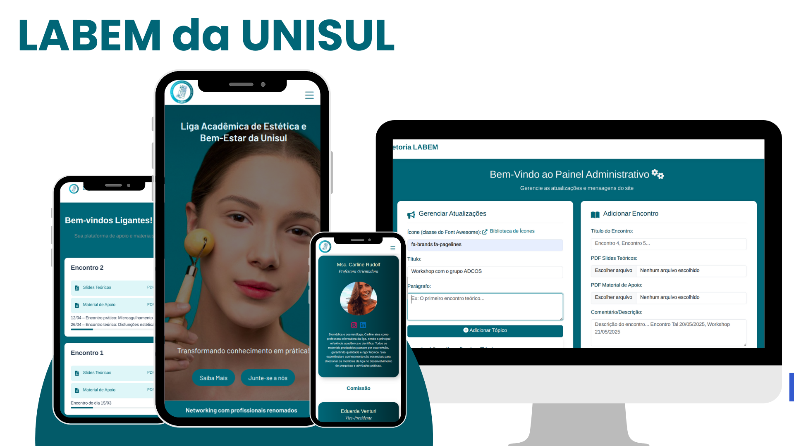
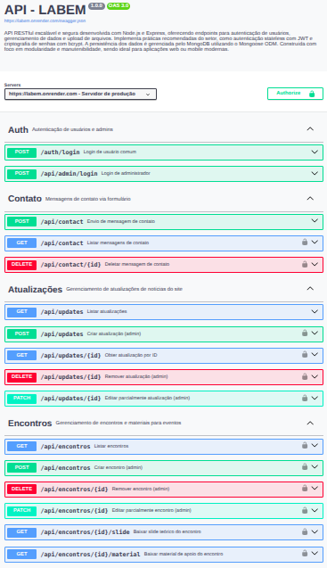
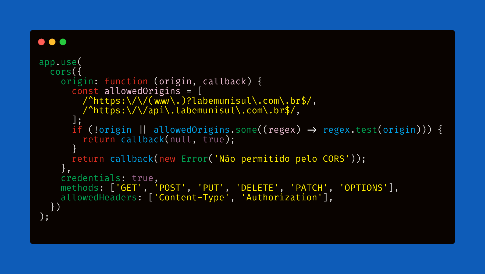
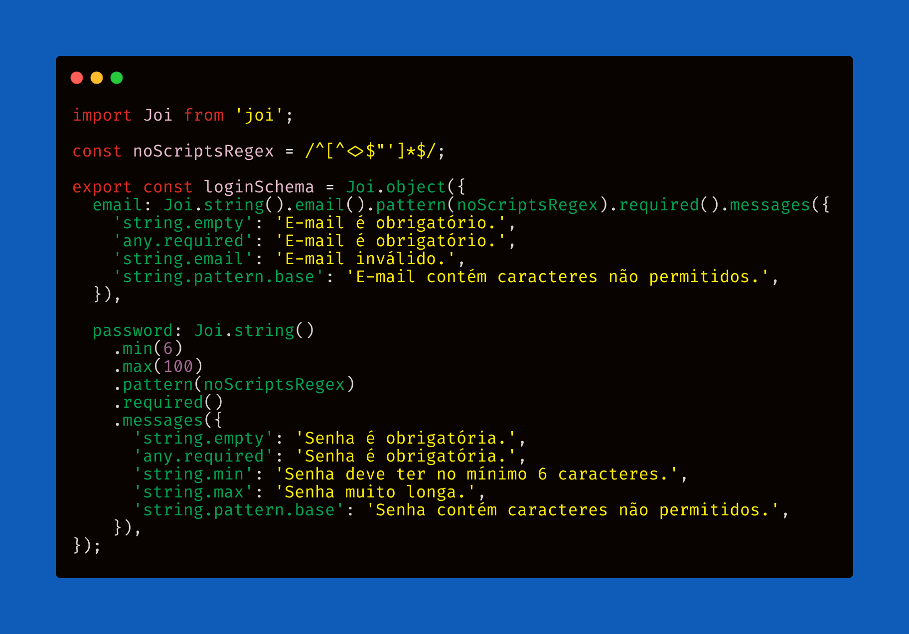
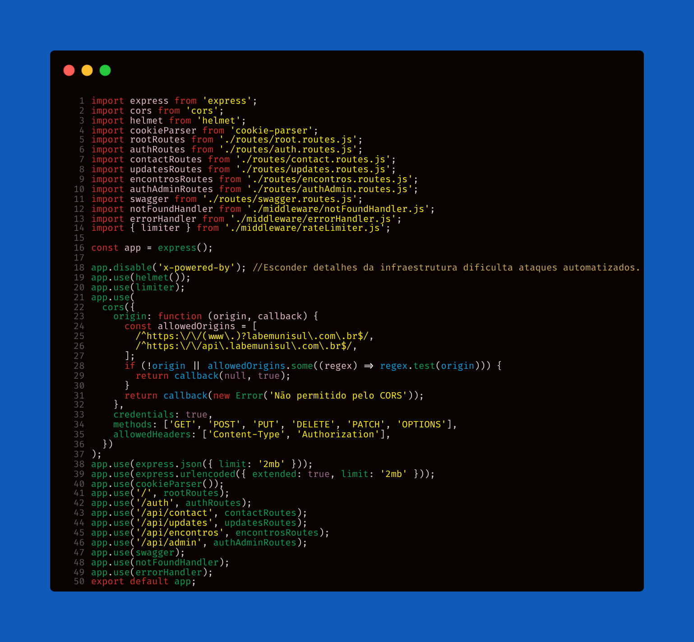

<!-- Aqui é o titulo! -->

  

<!-- stacks -->

  
  
  
  
  

  
 

     

<!-- imagem -->

<h2>Objetivo do Projeto</h2> 

 Sistema desenvolvido para aprimorar a gestão da Liga Acadêmica de Biomedicina Estética da UNISUL, proporcionando um ambiente digital centralizado para networking, organização de eventos, workshops e parcerias com marcas do setor. Até então, a instituição não dispunha de uma solução própria capaz de integrar o compartilhamento de materiais exclusivos, chamadas de pacientes-modelo e divulgação de parceiros estratégicos.
O sistema disponibiliza painéis seguros e personalizados para professores, coordenadores, presidente da liga e ligantes, oferecendo controle eficiente sobre conteúdos, eventos e comunicação interna. Projetado para atender tanto ao público acadêmico quanto à comunidade externa, o projeto reforça o profissionalismo, a transparência e a excelência na gestão das atividades da liga.

<h2>Docs</h2> 

Acesse a documentação Swagger em:  
<a href="https://www.labemunisul.com.br/swagger.html">https://www.labemunisul.com.br/swagger.html</a>

<h2>Autenticação e Segurança</h2>

A autenticação <code>JWT</code> utiliza <strong>cookies httpOnly</strong> para armazenar o token de sessão, aumentando a segurança contra ataques XSS. O backend faz uso do middleware <code>cookie-parser</code> para ler os cookies de autenticação nas requisições protegidas. O frontend foi adaptado para não manipular tokens diretamente, usando <code>credentials: 'include'</code> em todas as requisições autenticadas. Uso a lib <code>dotenv</code> para variáveis sensíveis, senhas criptografadas com <code>bcrypt</code> e <code>CORS</code> habilitado para integração frontend/backend.
<strong>O sistema não há sistema de cadastro, é uma equipe FIXA! Então gerei o acesso por um script temp, salvando a senha com hash por <code>bcrypt.hash()</code>  </strong>

<h2>Integração de Domínios:</h2>
O backend está hospedado em um subdomínio e o frontend no domínio principal. Isso garante o funcionamento seguro dos cookies <code>httpOnly</code> para autenticação JWT e integração correta entre frontend e backend.

<h2>Painéis e Funcionalidades</h2>

<strong style="font-weight:600; font-size:1.1em;">Painel Administrativo</strong> 
Implementei API para Últimas Notícias para manutenção do sistema principal (GET updates é a única rota pública). Desenvolvi API para upload de PDFs via <code>Multer</code>, com preview de arquivos e atualizações em tempo real. Gerenciei mensagens do formulário de contato com endpoints GET e DELETE, aumentando os números de parceria com o projeto. Resumindo, administradores podem utilizar as rotas para criar, atualizar, e excluir dados gerais de todo o sistema. 

<strong style="font-weight:600; font-size:1.1em;">Painel do Ligante</strong> 
Acesso restrito aos membros da UNISUL. Organização de eventos com profissionais da área biomédica. Recepção de conteúdos enviados pelos coordenadores, professores e presidente.

<h2>Stacks</h2>

No backend utilizei <code>Node</code> com <code>Express</code>, <code>MongoDB Atlas</code> e <code>Mongoose</code> para conexão e modelagem do banco de dados, <code>JWT</code> junto com <code>cookie-parser</code> para autenticação segura via cookies httpOnly, <code>bcrypt</code> para hash de senhas, <code>Multer</code> para upload de arquivos, <code>CORS</code> para requisições externas, <code>dotenv</code> para variáveis de ambiente, <code>winston</code> para logging estruturado, <code>express-rate-limit</code> para limitar requisições, <code>Joi</code> para validação de dados e <code>ESModules</code> (import/export). No frontend, utilizei <code>HTML</code> e <code>CSS</code> para a estrutura e estilo da interface, <code>Bootstrap</code> para responsividade e componentes visuais, <code>JavaScript Vanilla</code> para interatividade, e a API nativa do JS, <code>Fetch</code>, para consumir os dados da API de forma assíncrona.

<h2>Logging</h2>

O backend utiliza a biblioteca <code>winston</code> para logging estruturado. Todos os erros e eventos importantes são registrados tanto no console quanto em arquivos na pasta <code>logs/</code> do projeto. Isso facilita o monitoramento, auditoria e manutenção do sistema.

<h2>Validação de Requests</h2>

Utilizo Joi para garantir a validação rigorosa dos dados enviados às rotas protegidas do backend. Os schemas asseguram que todos os campos obrigatórios estejam presentes e formatados corretamente, tanto para operações de criação quanto de edição (ex: encontros, atualizações, autenticação).
A validação é implementada como middleware, impedindo que dados inválidos cheguem à lógica da aplicação. Além das validações tradicionais, aplico expressões regulares para bloquear caracteres potencialmente perigosos (como <, >, $, ", '), reforçando a proteção contra ataques de injeção e XSS. As mensagens de erro são claras e objetivas, facilitando a identificação de problemas durante o consumo da API.

<h2>Testes Automatizados</h2>

 Os testes unitários foram implementados com o <code>Poku</code> leve, rápido e brasileiro! 🇧🇷
Além disso, utilizei <code>Thunder Client</code> e <code>HTTPie</code> para testes manuais dos endpoints.

<h2>App.js do projeto</h2>

<h2>Em andamento</h2>

 O aplicativo está sendo "traduzido" para TypeScript para futuras features, já que a equipe atual continuará na LABEM até 2026, e uma nova equipe fixa assumirá com novas regras de négocio e manunteções futuras. 

<h2>Estrutura do Projeto</h2>
<pre><code>.
├── frontend
├── backend
│   ├── server.js
│   ├── .env
│   ├── package.json
│   └── src
│       ├── app.js
│       ├── config
│       │   └── db.js
│       ├── controllers
│       │   ├── authAdmin.Controller.js
│       │   ├── auth.Controller.js
│       │   ├── contact.Controller.js
│       │   ├── encontros.Controller.js
│       │   ├── root.Controller.js
│       │   └── updates.Controller.js
│       ├── middleware
│       │   ├── authenticateJWT.js
│       │   ├── authorizeAdmin.js
│       │   ├── errorHandler.js
│       │   ├── notFoundHandler.js
│       │   ├── rateLimiter.js
│       │   └── validate.js
│       ├── models
│       │   ├── ContactMessage.js
│       │   ├── CreateEncontro.js
│       │   ├── Update.js
│       │   ├── User.js
│       │   └── UserAdmin.js
│       ├── routes
│       │   ├── auth.routes.js
│       │   ├── authAdmin.routes.js
│       │   ├── contact.routes.js
│       │   ├── encontros.routes.js
│       │   ├── root.routes.js
│       │   ├── swagger.routes.js
│       │   └── updates.routes.js
│       ├── utils
│       │   └── logger.js
│       ├── validators
│       │   ├── authValidator.js
│       │   ├── contactValidator.js
│       │   ├── encontroValidator.js
│       │   └── updateValidator.js
│       └── swagger.json
</code></pre>

<h2>Como rodar localmente</h2>

Clone este repositório, crie um arquivo <code>.env</code> com base no exemplo fornecido, instale as dependências com <code>npm install</code> e, se necessário, ajuste o <code>CORS</code> para permitir o uso com a interface gráfica local.
Este sistema não possui fluxo de cadastro: O acesso é limitado a uma equipe fixa. Para gerar um usuário com acesso administrativo, utilize um script temporário que insira manualmente os dados no banco, salvando a senha com <code>bcrypt.hash()</code>.
Todas as requisições autenticadas do frontend já usam <code>credentials: 'include'</code> para envio de cookies. 

<h2>Deploy</h2>

O frontend da aplicação foi publicado com a <code>Vercel</code>. O backend está publicado na 
<code>Render</code>. A URL gerada permite que o front consuma a API normalmente.

